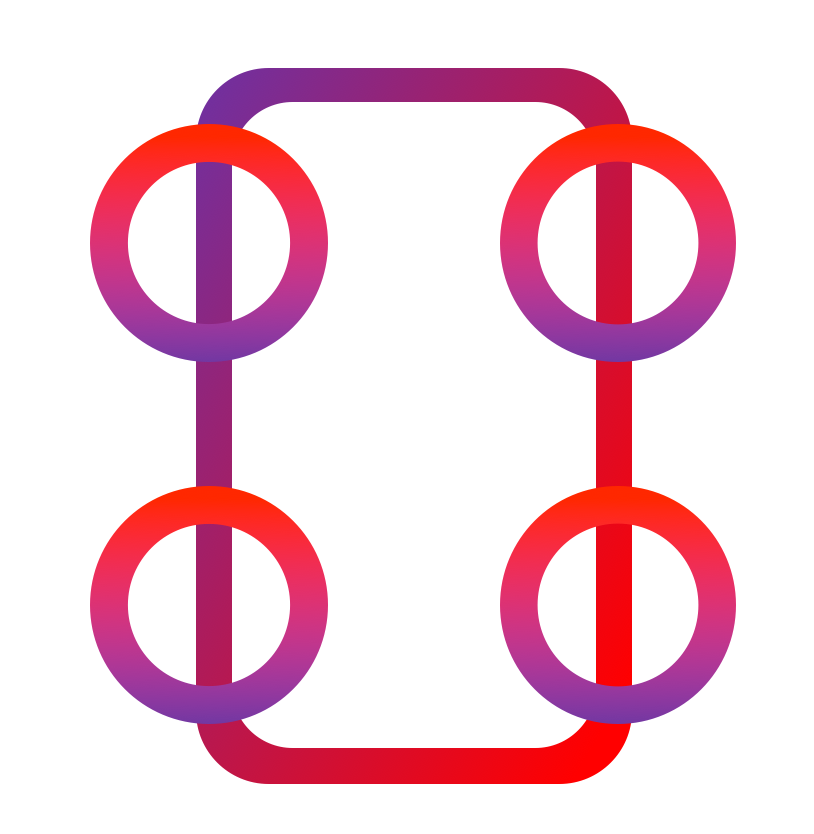

<!--
*** Thanks for checking out this README Template. If you have a suggestion that would
*** make this better, please fork the repo and create a pull request or simply open
*** an issue with the tag "enhancement".
*** Thanks again! Now go create something AMAZING! :D
***
***
***
*** To avoid retyping too much info. Do a search and replace for the following:
*** tylertaewook, project-orbitron, alitecraft, taewook.kim@columbia.edu
-->

<!-- PROJECT SHIELDS -->
<!--
*** I'm using markdown "reference style" links for readability.
*** Reference links are enclosed in brackets [ ] instead of parentheses ( ).
*** See the bottom of this document for the declaration of the reference variables
*** for contributors-url, forks-url, etc. This is an optional, concise syntax you may use.
*** https://www.markdownguide.org/basic-syntax/#reference-style-links
-->

<!-- PROJECT LOGO -->
 

  

  <h3 align="center">Project Orbitron</h3>

  

    A unique control algorithm in Mathematica for 4WIS/WID vehicles
     
    <a href="https://github.com/tylertaewook/project-orbitron"><strong>Explore the docs »</strong></a>
     
     
    <a href="https://github.com/tylertaewook/project-orbitron">View Demo</a>
    ·
    <a href="https://github.com/tylertaewook/project-orbitron/issues">Report Bug</a>
    ·
    <a href="https://github.com/tylertaewook/project-orbitron/issues">Request Feature</a>
  

<!-- TABLE OF CONTENTS -->
## Table of Contents

* [About the Project](#about-the-project)
  * [Orbitron](#orbitron)
  * [Algorithm](#algorithm)
* [Build Notes](#build-notes)
  * [Spherical Wheels](#spherical-wheels)
  * [Main Body](#main-body)
* [Contact](#contact)
* [Acknowledgements](#acknowledgements)

================================================================
> **[[LINK - MAKER PORTFOLIO]](https://youtu.be/WXjisSnfGTI)**

================================================================

<!-- ABOUT THE PROJECT -->
## About The Project

Project Orbitron is an independent build/research project done in December 2017 - March 2018. 
The project began as a simple yet powerful urge to build a vehicle with spherical wheels after being inspired by [Goodyear 360](https://youtu.be/oSFYwDDVgac) but soon evolved into a research project under Kent Guild, academic society at Kent School, after realizing vehicle's potential. After presenting a project proposal in front of Kent Pre-Engineering Department, Project Orbitron was granted with $1,000 fund.

The finished algorithm is going through a patent process as of October 2020. (*Application Number: KR 10-2019-0087022*)

The project is divided into two big components:
* Building a vehicle with a spherical wheel that implements a 4 wheel independent steering/driving system in Arduino and C# Winform Application.
* Development of a unique control algorithm in Mathematica

<!-- ORBITRON -->
### Orbitron

Simply put, Orbitron is a vehicle with spherical wheels. The spherical wheels allow the efficient implementation of a 4WIS/4WID (4 Wheel Independent Steering/Driving) system. 4WIS/4WID is a steering system for a four-wheeled vehicle that allows for separate speed and direction controls for each wheel.
To accomplish this, each wheel has two separate motors each controlling speed and direction.

While building the Orbitron, a simple C# WinForms application was developed. This application communicates with Orbitron via XBee wireless module and controls simple movements to ensure every component is working properly.

<!-- ALGORITHM -->
### Algorithm

This intuitive control algorithm written in Mathematica is an attempt to control a 4WIS/4WID vehicle requiring intuitive yet simultaneous control of eight different parameters. I used 3dconnexion's [Spacemouse](https://3dconnexion.com/us/product/spacemouse-compact/) as an input device, and its inputs were integrated coherently by modeling the vehicle's movement as a motion along a circular path, where a straight-line motion is calculated as a motion along a circle of very large radius.

Similar to the C# WinForms application, this algorithm communicates with Orbitron via XBee module. The XBee module integrated in Orbitron's Arduino shield allows maximum range of one mile.

<!-- BUILD NOTES -->
## Build Notes

This build note summarizes the three-month journey. For more detailed Build/Research Notebook, click **[HERE](https://github.com/tylertaewook/project-orbitron/blob/main/Research-Notebook.pdf)

<!-- SPHERICAL WHEELS -->
### Spherical Wheels

After an initial sketch of spherical wheel structure, the same design was modeled in Fusion 360. The CAD design was later modified from circular frame to rectangular frame to make woodworking easier. 
This design has two motors for each wheel. The HS-785HB servo with built-in gearbox on the top allows to control the wheel's direction by turning the entire rectangular structure. The 170-RPM Econ Gear Motor directly connected to sphere's shaft takes care of actually driving the wheel and controlling its speed.

This is the photo of a finished wheel taken in Kent School's Pre-Engineering Center. As wheel structure required boring many holes and cutting solid wood, most of the work was done with Pre-E center's powertools.

This is the [HS-785HB Servo](https://www.servocity.com/hs-785hb-servo/) with its 7:1 ratio metal gearbox. This certain servo has a range of 2880 degrees, unlike normal servo's 180 degrees range, which allows for almost 360 degree movement even with the gearbox.

<!-- MAIN BODY -->
### Main Body

Initial design was sketched on paper and soon moved to Fusion 360 CAD design. The body is shaped like two big 'H' glued together to have room for each spherical wheels.

I built the body out of MDF board at first, but it proved to be too heavy. Therefore, the final body was made of PVC Foamex board which was lighter and stronger. In order to support its entire weight more stabily, PVC tubes were screwed in.

To work on this project during summer vacation when I flied back to Korea, the body was carefully designed to be folded. This made it much easier for overseas shipping without breaking any of the components. When shipped, each wheel structure was detached from body and packaged separately.

For more detailed parts list with prices, click [HERE](https://github.com/tylertaewook/project-orbitron/blob/main/Parts%20List.pdf)

<!-- CONTACT -->
## Contact

Tyler Kim - taewook.kim@columbia.edu

Project Link: [https://github.com/tylertaewook/project-orbitron](https://github.com/tylertaewook/project-orbitron)

<!-- ACKNOWLEDGEMENTS -->
## Acknowledgements

* [Dr. Ben Nadire, Guild Advisor]()
* [Mr. Kevin Saxton, AP Computer Science Instructor]()

<!-- MARKDOWN LINKS & IMAGES -->
<!-- https://www.markdownguide.org/basic-syntax/#reference-style-links -->
[contributors-shield]: https://img.shields.io/github/contributors/tylertaewook/repo.svg?style=flat-square
[contributors-url]: https://github.com/tylertaewook/repo/graphs/contributors
[forks-shield]: https://img.shields.io/github/forks/tylertaewook/repo.svg?style=flat-square
[forks-url]: https://github.com/tylertaewook/repo/network/members
[stars-shield]: https://img.shields.io/github/stars/tylertaewook/repo.svg?style=flat-square
[stars-url]: https://github.com/tylertaewook/repo/stargazers
[issues-shield]: https://img.shields.io/github/issues/tylertaewook/repo.svg?style=flat-square
[issues-url]: https://github.com/tylertaewook/repo/issues
[license-shield]: https://img.shields.io/github/license/tylertaewook/repo.svg?style=flat-square
[license-url]: https://github.com/tylertaewook/repo/blob/master/LICENSE.txt
[linkedin-shield]: https://img.shields.io/badge/-LinkedIn-black.svg?style=flat-square&logo=linkedin&colorB=555
[linkedin-url]: https://linkedin.com/in/tylertaewook
[product-screenshot]: images/screenshot.png
